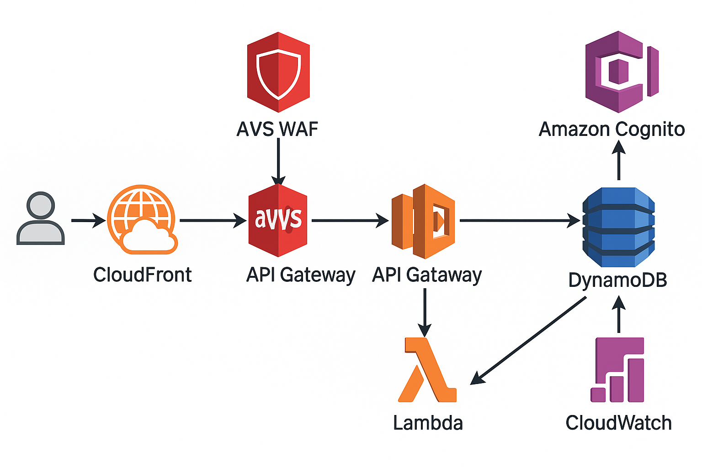

# URL Shortener Architecture Documentation




This document describes the full serverless URL Shortener architecture on AWS, detailing each component, its role, configuration, and interactions.

---

## 1. Overview
A globally distributed, fully serverless URL Shortener that:

- Accepts authenticated requests to shorten URLs
- Redirects public short codes to original URLs
- Protects against malicious traffic
- Scales automatically with demand
- Provides observability via CloudWatch

Traffic flow:

```
User → CloudFront → AWS WAF → API Gateway → Lambda → DynamoDB
                                  ↳ Cognito (JWT Authorizer)
                                  ↳ CloudWatch (logs & metrics)
```

---

## 2. Components

### 2.1 Amazon CloudFront (CDN)
- **Role**: Edge caching and global distribution of API calls.
- **Key settings**:
  - Origin: API Gateway invoke URL
  - Viewer Protocol Policy: Redirect HTTP → HTTPS
  - Caching: TTL = 0 for dynamic routing
  - Forwarded Headers: Authorization (JWT)
  - Cookies: forward none

### 2.2 AWS WAF (Web ACL)
- **Role**: Rate limiting and IP-based protections.
- **Rules**:
  - Rate-based rule: block if >1,000 requests per 5 minutes per IP
  - Attach to CloudFront distribution

### 2.3 Amazon API Gateway (HTTP API)
- **Role**: Public REST interface for `/shorten` and `/{code}` routes.
- **Routes**:
  - `POST /shorten` (JWT-authorized)
  - `GET /{code}` (public)
- **Authorizer**: JWT via Cognito User Pool
- **Integration**: AWS_PROXY → Lambda

### 2.4 Amazon Cognito (User Pool)
- **Role**: User management and JWT issuance for API authorization.
- **Flows enabled**: USER_PASSWORD_AUTH, REFRESH_TOKEN_AUTH

### 2.5 AWS Lambda (Compute)
- **Role**: Handle shorten & redirect logic in your chosen language (Go, Node.js, TypeScript, Ruby).
- **Configuration**:
  - Runtime & handler selected by `lambda_language` Terraform variable
  - IAM Role with DynamoDB permissions + CloudWatch Logging
  - Environment variables: `TABLE_NAME`, `REGION`, `USER_POOL_ID`
  - Active X-Ray tracing enabled

#### Lambda Logic
- **`POST /shorten`**:
  1. Validate JWT via API Gateway
  2. Parse `{"url": "<long_url>"}`
  3. Generate 6-char code
  4. Write to DynamoDB with TTL = 24 h
  5. Return `{"shortUrl":"https://<domain>/<code>"}`

- **`GET /{code}`**:
  1. Look up `short_code` in DynamoDB
  2. If found → 301 redirect to `long_url`
  3. Else → 404 Not Found

### 2.6 Amazon DynamoDB (NoSQL)
- **Role**: Persistence for URL mappings.
- **Table**: `short_code` (PK), attributes `long_url`, `expires_at` (TTL enabled)
- **Billing**: On-demand mode

### 2.7 Amazon CloudWatch (Observability)
- **Logs**: Lambda function execution logs
- **Metrics & Alarms**:
  - Lambda Errors > 1 in 5 m → Send alert
  - WAF metrics (sampled requests)

---

## 3. Infrastructure as Code (Terraform)
- **State backend**: S3 bucket with workspace-specific keys
- **Workspaces**: dev, staging, prod
- **Variables**:
  - `aws_region`
  - `lambda_language` (`go`,`nodejs`,`typescript`,`ruby`)

Key resources:

```hcl
# Select runtime
locals { selected = local.lambda_config[var.lambda_language] }

data "archive_file" "lambda_zip" { source_dir = local.selected.dir }

resource "aws_lambda_function" "shortener" {
  runtime = local.selected.runtime
  handler = local.selected.handler
  filename = data.archive_file.lambda_zip.output_path
  # … environment, role, tracing …
}

resource "aws_cloudfront_distribution" "cdn" {
  origin { domain_name = replace(api_invoke_url, "https?://", "") }
  default_cache_behavior { target_origin_id = "api-origin" }
  # … viewer_certificate, restrictions …
}

resource "aws_wafv2_web_acl" "waf" { default_action { allow {} } rule { rate_based_statement { limit=1000 } block {} } }
```

Refer to the Terraform code for full definitions.

---

## 4. Deployment
1. **Prepare code**: place language-specific Lambda in `lambda/<lang>`
2. **Terraform**:
   ```bash
   terraform workspace select dev || terraform workspace new dev
   terraform init
   terraform apply -var="lambda_language=nodejs" -auto-approve
   ```
3. **Test**:
   - `POST /shorten` with valid JWT → receives short URL
   - `GET /{code}` → redirects

---

## 5. Security & Scaling
- **Authentication**: Cognito JWT authorizer
- **DDoS protection**: AWS WAF rate limiting at CloudFront
- **Scaling**:
  - Lambda: auto-scales concurrent execs
  - DynamoDB: on-demand mode
  - CloudFront: global edge caching

---

## 6. Monitoring & Maintenance
- **CloudWatch Alarms**:
  - Lambda errors
  - WAF blocked requests
- **TTL**: DynamoDB automatically purges expired codes
- **Logs**: CloudWatch Log Groups for Lambdas

For questions or further customization, refer to the full Terraform and Lambda source code.